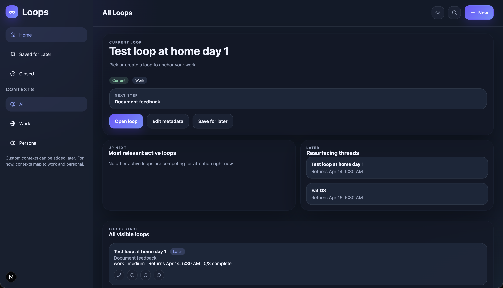

# Loops

Loops is a self-hostable personal command center built around threads of intent. This stack is set up so you can run everything locally on macOS during the first week, then point it at a cloud-hosted Postgres database and deploy the app server wherever you want later.

## Stack

- Next.js App Router for the web app and API routes
- Prisma for database access and schema management
- PostgreSQL as the persistent database
- Cookie-backed session auth with email/password login

## Local setup

1. Copy `.env.example` to `.env`.
2. Start Postgres locally.
   - With Docker: `docker compose up -d`
   - Or point `DATABASE_URL` at your own Postgres server
3. Install dependencies: `npm install`
4. Generate Prisma client: `npm run db:generate`
5. Push the schema: `npm run db:push`
6. Optional demo data: `npm run db:seed`
7. Start the app: `npm run dev`

The seeded demo account is:

- Email: `demo@loops.local`
- Password: `demo1234`

## Remote device testing

For Android browser testing while the app runs on your Mac:

1. Start the app with `npm run dev`
2. Expose it with a tunnel like `ngrok http 3000`
3. Open the tunnel URL on your phone

If you later deploy on your own server, keep the app and database on that machine or point the app server at a managed/self-hosted Postgres instance by changing `DATABASE_URL`.

## Production deploy on your own server

This repo now includes a simple production stack for a single server:

- `Dockerfile` for the Next.js app
- `docker-compose.prod.yml` for the app and Postgres
- `deploy.env.example` for the server-side environment variables

### 1. Install Docker on the server

You need Docker Engine and the Docker Compose plugin available over SSH.

### 2. Copy the project and configure env

On the server:

1. Clone or copy this repo
2. Copy `deploy.env.example` to `deploy.env`
3. Set `POSTGRES_PASSWORD` to a strong random password

### 3. Start the stack

Run:

```bash
docker compose --env-file deploy.env -f docker-compose.prod.yml up -d --build
```

This starts PostgreSQL first, waits for it to become healthy, then starts the app. The app container runs `prisma db push` before startup so the schema is created automatically.

### 4. Optional demo data

If you want the seeded demo account in production:

```bash
docker compose --env-file deploy.env -f docker-compose.prod.yml exec app npm run db:seed
```

### 5. Updates

When you pull new code on the server, redeploy with:

```bash
docker compose --env-file deploy.env -f docker-compose.prod.yml up -d --build
```

### Notes

- The app is published directly on port `3000`.
- If you want to put DuckDNS, Caddy, Nginx, or another proxy in front later, you can do that outside this compose file.
- If you want to use an external Postgres server later, replace the `DATABASE_URL` logic in `docker-compose.prod.yml` and remove the bundled `db` service.

## Deploy on Render

If you deploy this repo to Render using the Docker runtime:

1. Set `DATABASE_URL` to your Render Postgres internal URL
2. Make sure the database schema is created before sign-in traffic hits the app

For this project, the simplest schema step is:

```bash
npx prisma db push
```

You can run that either:

- as a pre-deploy command in Render
- or in the service's Docker command before startup

Example Docker command in Render:

```bash
sh -c "npx prisma db push && npm run start"
```

### Notes

- Render can detect port `3000` automatically for this Docker service, so no custom `PORT` handling is required here.
- The Dockerfile installs `openssl`, which Prisma may require on slim Debian-based images.
- This project currently uses Prisma `db push` for production schema setup, not versioned Prisma migrations. If you want safer deploy history later, switch to Prisma migrations and use `npx prisma migrate deploy` instead.

## Screenshots


